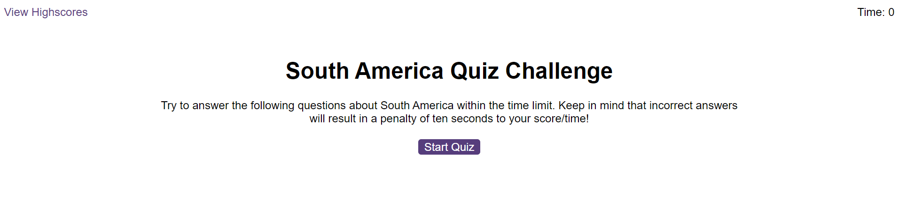
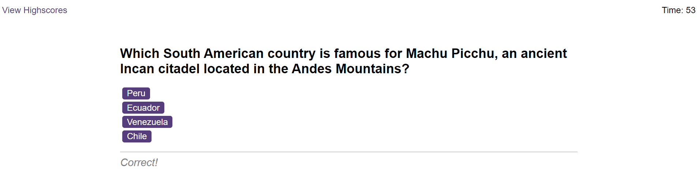
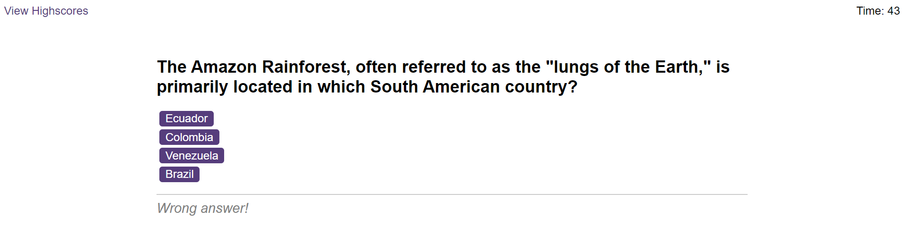
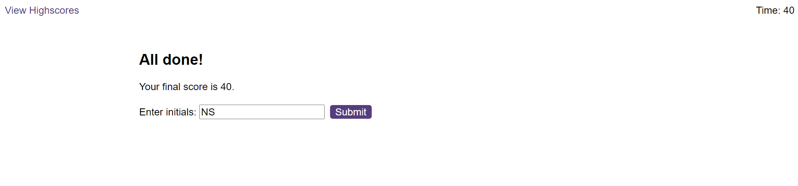

# SouthAmerica-Quiz
- The quiz features a set of multiple-choice questions about South American Countries, accompanied by a countdown timer. Once the quiz is finished, users can submit their scores along with their initials. These scores are then saved on a leaderboard, showcasing achievements from various users.

# Usage
Deployed project URL: 
https://nicolesang.github.io/SouthAmerica-Quiz/

These screenshots shows how the Quiz looks:

Press 'Start Quiz' to start the quiz. You will see a question with 4 choices. When the answer is correct, the next question will be displayed and the user will se the message "Correct!"

If the answer is incorrect, the user will see the message "Wrong answer!" and the timer will deduct 10 seconds for each incorrect response.

Keep following until the quiz is finished. After you've finished, you'll see a screen with your final score and a space to enter your initials.

The score will be saved in a leaderboard with all the scores from various users. It should look like this:

## License
MIT License

Copyright (c) [2024] [Karen Nicole Santamaria Granizo]

Permission is hereby granted, free of charge, to any person obtaining a copy
of this software and associated documentation files (the "Software"), to deal
in the Software without restriction, including without limitation the rights
to use, copy, modify, merge, publish, distribute, sublicense, and/or sell
copies of the Software, and to permit persons to whom the Software is
furnished to do so, subject to the following conditions:

The above copyright notice and this permission notice shall be included in all
copies or substantial portions of the Software.

THE SOFTWARE IS PROVIDED "AS IS", WITHOUT WARRANTY OF ANY KIND, EXPRESS OR
IMPLIED, INCLUDING BUT NOT LIMITED TO THE WARRANTIES OF MERCHANTABILITY,
FITNESS FOR A PARTICULAR PURPOSE AND NONINFRINGEMENT. IN NO EVENT SHALL THE
AUTHORS OR COPYRIGHT HOLDERS BE LIABLE FOR ANY CLAIM, DAMAGES OR OTHER
LIABILITY, WHETHER IN AN ACTION OF CONTRACT, TORT OR OTHERWISE, ARISING FROM,
OUT OF OR IN CONNECTION WITH THE SOFTWARE OR THE USE OR OTHER DEALINGS IN THE
SOFTWARE.